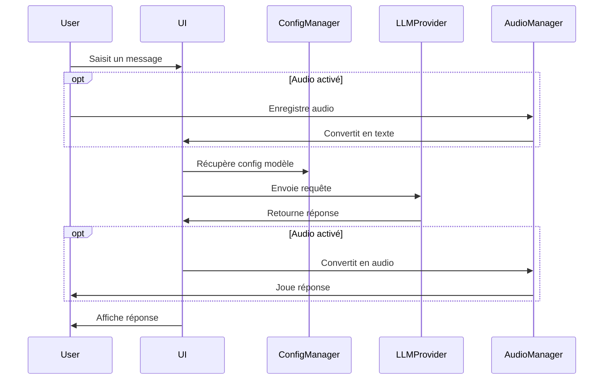

# Architecture du Chat LLM

## Interfaces Principales

### 1. Interface LLM Base (`src/api/base.py`)

```python
class LLMProvider(ABC):
    """Interface de base pour tous les fournisseurs LLM."""
    
    @abstractmethod
    async def chat_completion(self, 
        messages: list[dict],
        temperature: float = 0.7,
        max_tokens: int = 1000
    ) -> str:
        """Génère une réponse basée sur l'historique des messages."""
        pass
    
    @abstractmethod
    def validate_credentials(self) -> bool:
        """Vérifie que les credentials sont valides."""
        pass
```

### 2. Interface Audio (`src/audio/interface.py`)

```python
class AudioManager(ABC):
    """Gestionnaire des fonctionnalités audio."""
    
    @abstractmethod
    async def start_recording(self) -> None:
        """Démarre l'enregistrement audio."""
        pass
        
    @abstractmethod
    async def stop_recording(self) -> bytes:
        """Arrête l'enregistrement et retourne les données audio."""
        pass
        
    @abstractmethod
    async def text_to_speech(self, text: str) -> bytes:
        """Convertit le texte en audio."""
        pass
```

### 3. Gestionnaire de Configuration (`src/config/settings.py`)

```python
class ConfigManager:
    """Gestion de la configuration de l'application."""
    
    def load_api_keys(self) -> dict:
        """Charge les clés API depuis le stockage sécurisé."""
        pass
        
    def save_api_key(self, provider: str, key: str) -> None:
        """Enregistre une clé API de manière sécurisée."""
        pass
        
    def get_model_config(self, provider: str) -> dict:
        """Récupère la configuration d'un modèle."""
        pass
```

### 4. Gestionnaire d'État UI (`src/ui/state.py`)

```python
class UIState:
    """Gestion de l'état de l'interface utilisateur."""
    
    def update_chat_history(self, message: dict) -> None:
        """Ajoute un message à l'historique."""
        pass
        
    def set_active_model(self, model: str) -> None:
        """Définit le modèle LLM actif."""
        pass
        
    def toggle_audio(self, enabled: bool) -> None:
        """Active/désactive les fonctionnalités audio."""
        pass
```

## Flux de Données



## Points d'Extension

1. **Nouveaux Fournisseurs LLM**
   - Implémenter `LLMProvider`
   - Ajouter configuration dans `config/models.py`
   - Enregistrer dans la factory de providers

2. **Fonctionnalités Audio**
   - Étendre `AudioManager` pour nouveaux formats
   - Ajouter nouveaux providers TTS/STT

3. **Interface Utilisateur**
   - Composants UI modulaires dans `ui/components`
   - Thèmes personnalisables
   - Nouveaux layouts

## Sécurité

1. **Stockage des Clés API**
   - Chiffrement au repos
   - Validation à l'utilisation
   - Rotation des clés

2. **Validation des Entrées**
   - Sanitization des entrées utilisateur
   - Rate limiting
   - Taille maximale des messages

## Tests

1. **Tests Unitaires**
   - Mocking des APIs LLM
   - Validation des interfaces
   - Gestion des erreurs

2. **Tests d'Intégration**
   - Flux complet avec mock providers
   - Performance et charge
   - Gestion de la concurrence

3. **Tests UI**
   - Interactions utilisateur
   - Accessibilité
   - Responsive design